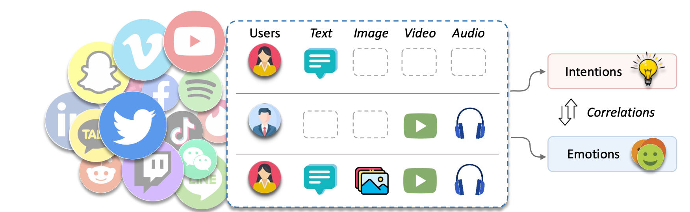
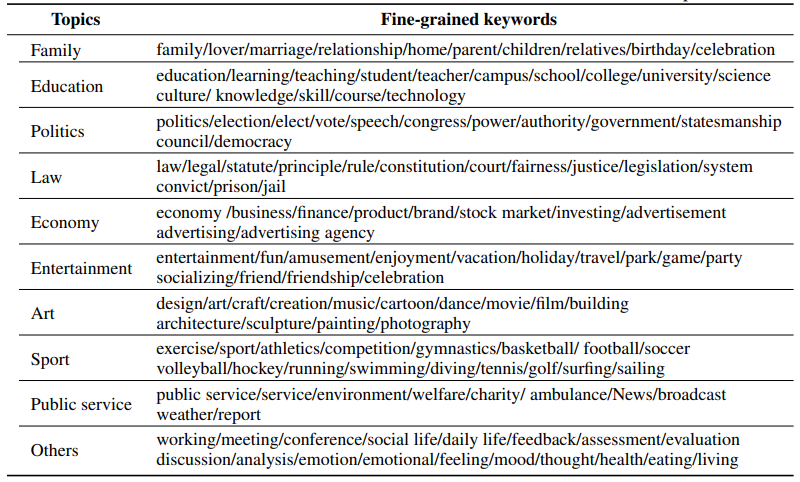
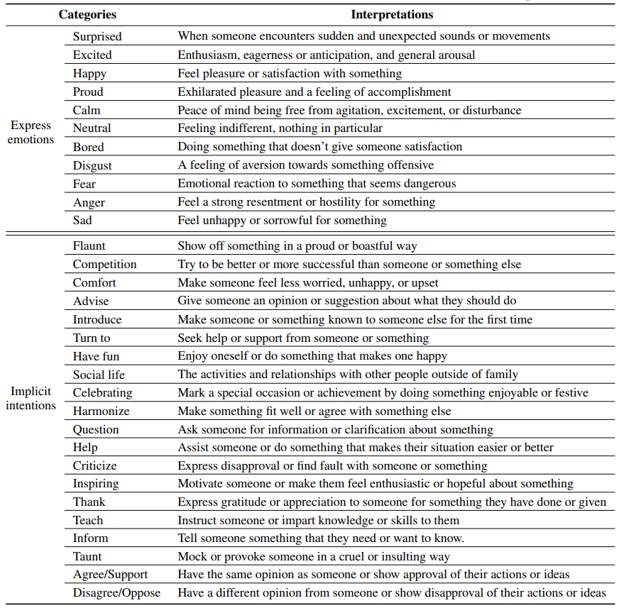

<div align="center">
  
# MINE: Uncertain Multimodal Intention and Emotion Understanding in the Wild

<a href="https://pytorch.org/get-started/locally/"></a>
[](https://cvpr.thecvf.com/)
[](https://openaccess.thecvf.com/content/CVPR2025/papers/Yang_Uncertain_Multimodal_Intention_and_Emotion_Understanding_in_the_Wild_CVPR_2025_paper.pdf)

</div>

## 0. Updates
- [ ] Code part of BEAR & MAP
- [x] :satisfied: (06/16/2025) Dataset Released!
- [x] :blush: (02/27/2025) Paper Accepted!

## 1. Abstract
Understanding intention and emotion from social media poses unique challenges due to the inherent uncertainty in multimodal data, where posts often contain incomplete or missing modalities. While this uncertainty reflects real-world scenarios, it remains underexplored within the computer vision community, particularly in conjunction with the intrinsic relationship between emotion and intention. To address these challenges, we introduce the **M**ultimodal **I**ntentio**N** and **E**motion Understanding in the Wild (**MINE**) dataset, comprising over 20,000 topic-specific social media posts with natural modality variations across text, image, video, and audio. MINE is distinctively constructed to capture both the uncertain nature of multimodal data and the implicit correlations between intentions and emotions, providing extensive annotations for both aspects. To tackle these scenarios, we propose the Bridging Emotion-Intention via Implicit Label Reasoning (BEAR) framework. BEAR consists of two key components: a BEIFormer that leverages emotion-intention correlations, and a Modality Asynchronous Prompt that handles modality uncertainty. Experiments show that BEAR outperforms existing methods in processing uncertain multimodal data while effectively mining emotion-intention relationships for social media content understanding. Dataset and code will be released.


### An overview of Multimodal Intention and Emotion Understanding



## 2. Dataset Construction

The overall process of building the MINE dataset is shown below:

### a. Data sources

We collect raw data from twitter with keywords, 2019-2022. 
### Keywords(hashtags) in data collection



### b. Intention and emotion taxonomies

### Emotion and intention taxonomies of our MINE dataset with brief interpretations



### c. Multimodal Intention and Emotion Annotation

#### Dataset Statistics

| Item                                      | Statistics |
| ----------------------------------------- | ---------- |
| Number of intentions          | 20          |
| Number of emotions            | 11         |
| Number of text                          | 20044        |
| Number of images                  | 12428      |
| Number of videos        | 3895     |
| Number of audios | 1615      |
| Average length of text utterances         | 20.0       |
| Total number of words      |489069      |
| Average duration of videos (s)       | 24.4      |
| Total duration of videos (h)     | 21.9       |


## 3. Experiments

The text features are extracted by a pre-trained BERT language model. The image features are extracted with ViT. The video features are extracted with Video_Swin_Transformer. The audio features are extracted by wav2vec 2.0 on audio time series.

The multimodal intention and emotion benchmarks contain two powerful multimodal fusion methods: MISA and MulT. 

## 4. Usage

### a. Acquire data

You can obtain the extracted feature and split files from [Google Drive](https://drive.google.com/file/d/10nlgKGZZFos7L2c2l1BJROEwuYyaaDMf/view?usp=sharing).

Dataset Description:

| Contents                       | Description                                                                                                                                                                                           |
| ------------------------------ | ----------------------------------------------------------------------------------------------------------------------------------------------------------------------------------------------------- |
| audio_data/audio_feats.pkl     | This directory includes the "audio_feats.pkl" file. It contains audio<br />feature tensors in each video segment.                                                                                     |
| image_data/image_feats.pkl     | This directory includes the "image_feats.pkl" file. It contains image<br />feature tensors.                                                                                     |
| text_data/text_feats.pkl     | This directory includes the "text_feats.pkl" file. It contains text<br />feature tensors.                                                                                     |
| video_data/video_feats.pkl     | This directory includes the "video_feats.pkl" file. It contains video<br />feature tensors for all keyframes in each video segment.                                                                   |
| train.tsv / dev.tsv / test.tsv | These files contain different split IDs and annotations.|

### b. Quick start

1. Use anaconda to create Python (version >=3.6) environment

   ```
   conda create --name MINE python=3.6
   conda activate MINE
   ```

2. Install PyTorch (Cuda version 11.2)

   ```
   conda install pytorch torchvision torchaudio cudatoolkit=11.2 -c pytorch
   ```

3. Clone the MINE-dataset repository.

   ```
   git clone https://github.com/yan9qu/CVPR25-MINE.git
   cd MINE-dataset
   ```


4. Run examples (Take MISA as an example)

   ```
   python run.py  --method MISA
   ```

## 5. Terms of Use: 
This dataset is intended for research purposes only, and it should not be used for any illegal, unethical, or harmful activities. The dataset contains tweets that express emotions and intentions, which may reflect the personal views, preferences, or vulnerabilities of the tweet authors. You should respect the privacy and dignity of the tweet authors and avoid any actions that may infringe their rights or cause them distress. You should also acknowledge the limitations and biases of the dataset and the analysis, and avoid any generalizations or misinterpretations that may lead to incorrect or misleading conclusions. You are solely responsible for any consequences that may arise from your use or misuse of the dataset. The original authors of the dataset are not liable for any damages or losses that may result from your use or misuse of the dataset.

## 6. Acknowledgements

Some of the codes in this repo are adapted from the following repos, and we are greatly thankful to them: [MIntRec](https://github.com/thuiar/MIntRec), [TalkNet](https://github.com/TaoRuijie/TalkNet-ASD), [SyncNet](https://github.com/joonson/syncnet_python).


